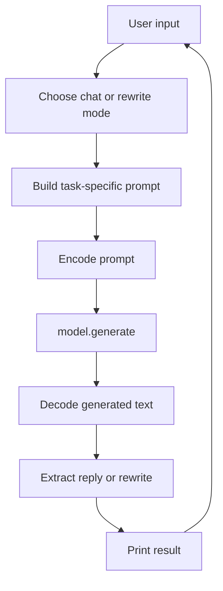

```mermaid
flowchart TD
    UserInput["User input"] --> ChooseMode["Choose chat or rewrite mode"]
    ChooseMode --> BuildPrompt["Build task-specific prompt"]
    BuildPrompt --> Encode["Encode prompt"]
    Encode --> Generate["model.generate"]
    Generate --> Decode["Decode generated text"]
    Decode --> ExtractReply["Extract reply or rewrite"]
    ExtractReply --> PrintReply["Print result"]
    PrintReply --> UserInput
```