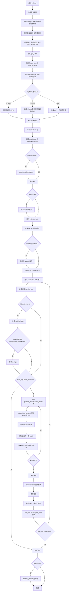

```mermaid
flowchart TD
    start["启动 train.py"] --> loadDefaults["加载默认配置"]
    loadDefaults --> overrideConfig["读取 config 文件和命令行参数覆盖配置"]
    overrideConfig --> setupDDP["判断是否 DDP 分布式训练"]
    setupDDP --> setupRuntime["设置设备、随机种子、输出目录、精度上下文"]

    setupRuntime --> dataLoader["定义 get_batch"]
    dataLoader --> initState["初始化 iter_num 和 best_val_loss"]
    initState --> loadMeta["尝试读取 meta.pkl 获取 vocab_size"]

    loadMeta --> initModelDecision{"init_from 是什么？"}
    initModelDecision -->|"scratch"| initScratch["随机初始化 GPT"]
    initModelDecision -->|"resume"| initResume["读取 ckpt.pt 恢复模型和训练状态"]
    initModelDecision -->|"gpt2*"| initGPT2["加载 GPT-2 预训练权重"]

    initScratch --> modelReady["模型准备完成"]
    initResume --> modelReady
    initGPT2 --> modelReady

    modelReady --> moveModel["model.to(device)"]
    moveModel --> setupOptim["创建 GradScaler 和 AdamW optimizer"]
    setupOptim --> maybeCompile{"compile=True？"}
    maybeCompile -->|"是"| compileModel["torch.compile(model)"]
    maybeCompile -->|"否"| maybeDDP["跳过编译"]
    compileModel --> maybeDDP

    maybeDDP --> ddpWrap{"ddp=True？"}
    ddpWrap -->|"是"| wrapDDP["用 DDP 包装模型"]
    ddpWrap -->|"否"| defineEval["定义 estimate_loss"]
    wrapDDP --> defineEval

    defineEval --> defineLR["定义 get_lr 学习率调度"]
    defineLR --> maybeWandb{"wandb_log=True？"}
    maybeWandb -->|"是"| initWandb["初始化 wandb 日志"]
    maybeWandb -->|"否"| firstBatch["获取第一个 train batch"]
    initWandb --> firstBatch

    firstBatch --> loopStart["进入 while True 训练循环"]

    loopStart --> setLR["设置当前 learning rate"]
    setLR --> evalCheck{"到 eval_interval？"}
    evalCheck -->|"是"| estimateLoss["计算 train/val loss"]
    estimateLoss --> saveCheck{"val loss 变好或 always_save_checkpoint？"}
    saveCheck -->|"是"| saveCkpt["保存 ckpt.pt"]
    saveCheck -->|"否"| evalOnlyCheck{"eval_only 且 iter_num=0？"}
    evalCheck -->|"否"| evalOnlyCheck
    saveCkpt --> evalOnlyCheck

    evalOnlyCheck -->|"是"| endTrain["结束训练"]
    evalOnlyCheck -->|"否"| accumLoop["循环 gradient_accumulation_steps 次"]

    accumLoop --> forward["model(X,Y) forward 得到 logits 和 loss"]
    forward --> scaleLoss["loss 除以累积步数"]
    scaleLoss --> nextBatch["提前读取下一个 batch"]
    nextBatch --> backward["backward 反向传播累积梯度"]
    backward --> accumDone{"累积完成？"}
    accumDone -->|"否"| accumLoop
    accumDone -->|"是"| clipGrad["梯度裁剪"]

    clipGrad --> optimizerStep["optimizer.step 更新参数"]
    optimizerStep --> zeroGrad["清空梯度"]
    zeroGrad --> logIter["打印 loss、耗时、MFU"]
    logIter --> incIter["iter_num 和 local_iter_num 加 1"]
    incIter --> stopCheck{"iter_num > max_iters？"}
    stopCheck -->|"否"| loopStart
    stopCheck -->|"是"| endTrain

    endTrain --> cleanupDDP{"ddp=True？"}
    cleanupDDP -->|"是"| destroyDDP["destroy_process_group"]
    cleanupDDP -->|"否"| done["完成"]
    destroyDDP --> done
```